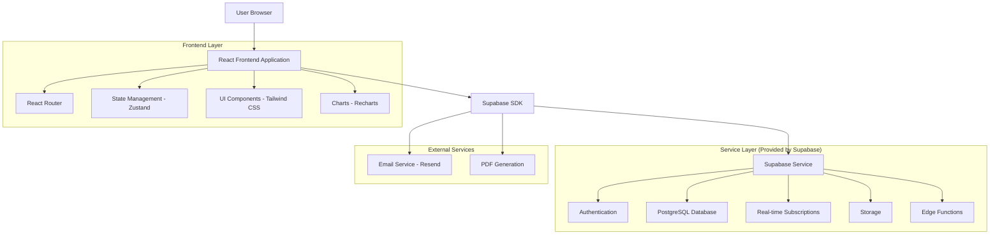
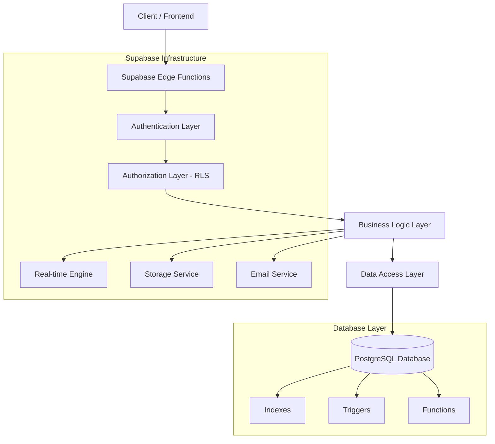
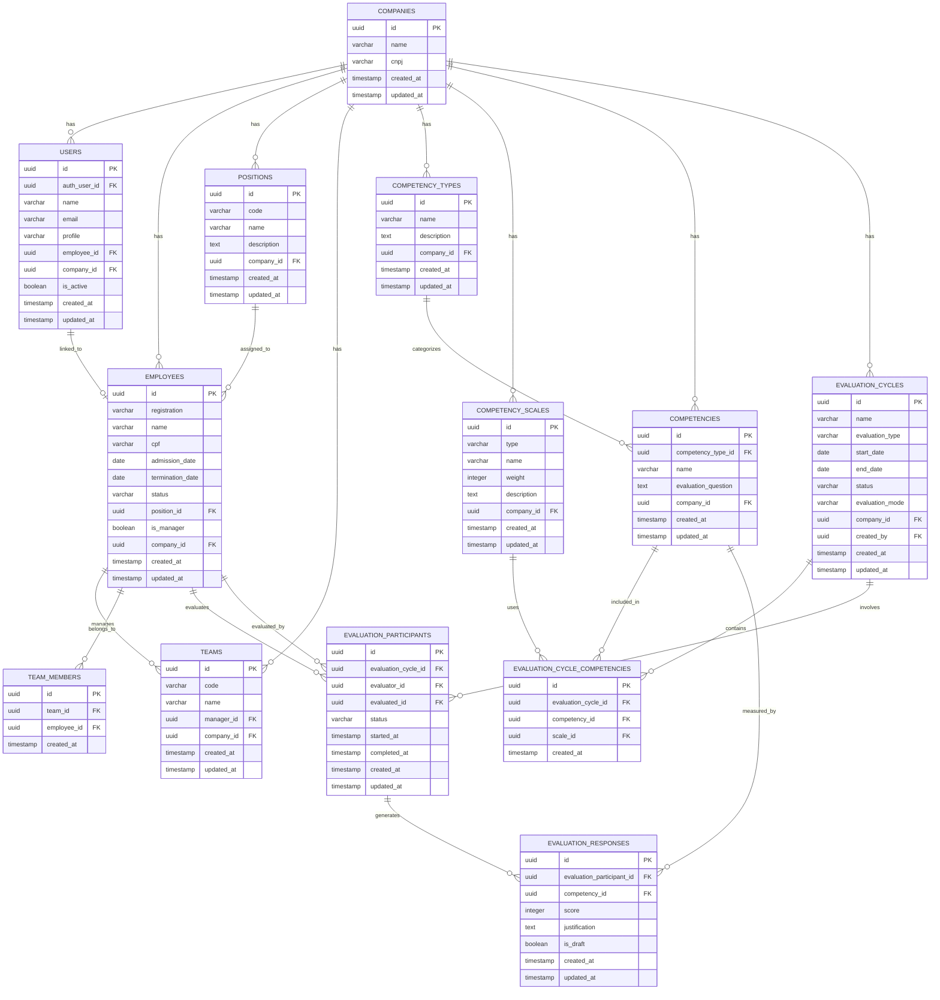

# Documento de Arquitetura Técnica - Sistema de Gestão de Desempenho

## 1. Architecture design



## 2. Technology Description

* **Frontend**: React\@18 + TypeScript + Tailwind CSS\@3 + Vite

* **Backend**: Supabase (PostgreSQL + Auth + Real-time + Storage)

* **State Management**: Zustand

* **Routing**: React Router v6

* **Charts**: Recharts

* **Forms**: React Hook Form + Zod

* **UI Components**: Headless UI + Radix UI

* **Icons**: Lucide React

* **Date Handling**: date-fns

* **PDF Generation**: jsPDF + html2canvas

* **Email**: Resend API

## 3. Route definitions

| Route                    | Purpose                                                    |
| ------------------------ | ---------------------------------------------------------- |
| /                        | Redirect para login ou dashboard baseado na autenticação   |
| /login                   | Página de login com autenticação via Supabase              |
| /forgot-password         | Recuperação de senha via email                             |
| /dashboard               | Dashboard principal com redirecionamento baseado no perfil |
| /admin/dashboard         | Dashboard específico do administrador                      |
| /manager/dashboard       | Dashboard específico do gestor                             |
| /employee/dashboard      | Dashboard específico do colaborador                        |
| /admin/competency-types  | Cadastro de tipos de competência                           |
| /admin/competency-scales | Cadastro de escalas de competência                         |
| /admin/competencies      | Cadastro de competências                                   |
| /admin/positions         | Cadastro de cargos                                         |
| /admin/employees         | Cadastro de colaboradores                                  |
| /admin/teams             | Cadastro de equipes                                        |
| /admin/users             | Cadastro de usuários                                       |
| /evaluations/create      | Criação de ciclos de avaliação                             |
| /evaluations/:id/respond | Interface de resposta às avaliações                        |
| /reports                 | Painel de relatórios com filtros dinâmicos                 |
| /reports/:type/:id       | Visualização específica de relatórios                      |
| /profile                 | Perfil do usuário logado                                   |
| /settings                | Configurações do sistema (admin)                           |

## 4. API definitions

### 4.1 Core API (Supabase Tables)

**Autenticação de Usuários**

```typescript
// Supabase Auth integrado
interface AuthUser {
  id: string;
  email: string;
  created_at: string;
  user_metadata: {
    name: string;
    profile: 'admin' | 'manager' | 'employee';
  };
}
```

**Gestão de Empresas**

```typescript
interface Company {
  id: string;
  name: string;
  cnpj: string;
  created_at: string;
  updated_at: string;
}
```

**Gestão de Usuários**

```typescript
interface User {
  id: string;
  auth_user_id: string; // FK para auth.users
  name: string;
  email: string;
  profile: 'admin' | 'manager' | 'employee';
  employee_id?: string; // FK para employees
  company_id: string; // FK para companies
  is_active: boolean;
  created_at: string;
  updated_at: string;
}
```

**Gestão de Cargos**

```typescript
interface Position {
  id: string;
  code: string;
  name: string;
  description: string;
  company_id: string;
  created_at: string;
  updated_at: string;
}
```

**Gestão de Colaboradores**

```typescript
interface Employee {
  id: string;
  registration: string;
  name: string;
  cpf: string;
  admission_date: string;
  termination_date?: string;
  status: 'active' | 'terminated';
  position_id: string; // FK para positions
  is_manager: boolean;
  company_id: string;
  created_at: string;
  updated_at: string;
}
```

**Gestão de Equipes**

```typescript
interface Team {
  id: string;
  code: string;
  name: string;
  manager_id: string; // FK para employees
  company_id: string;
  created_at: string;
  updated_at: string;
}

interface TeamMember {
  id: string;
  team_id: string; // FK para teams
  employee_id: string; // FK para employees
  created_at: string;
}
```

**Tipos de Competência**

```typescript
interface CompetencyType {
  id: string;
  name: string; // ex: 'TECNICA', 'COMPORTAMENTAL'
  description: string;
  company_id: string;
  created_at: string;
  updated_at: string;
}
```

**Escalas de Competência**

```typescript
interface CompetencyScale {
  id: string;
  type: string; // ex: 'Padrão', 'CLIMA'
  name: string; // ex: 'Adequado'
  weight: number; // ex: 3
  description: string;
  company_id: string;
  created_at: string;
  updated_at: string;
}
```

**Competências**

```typescript
interface Competency {
  id: string;
  competency_type_id: string; // FK para competency_types
  name: string; // ex: 'Adaptabilidade'
  evaluation_question: string;
  company_id: string;
  created_at: string;
  updated_at: string;
}
```

**Ciclos de Avaliação**

```typescript
interface EvaluationCycle {
  id: string;
  name: string;
  evaluation_type: 'performance' | 'climate' | 'onboarding' | 'offboarding';
  start_date: string;
  end_date: string;
  status: 'draft' | 'active' | 'completed' | 'cancelled';
  evaluation_mode: '90' | '180' | '360'; // graus de avaliação
  company_id: string;
  created_by: string; // FK para users
  created_at: string;
  updated_at: string;
}
```

**Competências do Ciclo**

```typescript
interface EvaluationCycleCompetency {
  id: string;
  evaluation_cycle_id: string; // FK para evaluation_cycles
  competency_id: string; // FK para competencies
  scale_id: string; // FK para competency_scales
  created_at: string;
}
```

**Participantes da Avaliação**

```typescript
interface EvaluationParticipant {
  id: string;
  evaluation_cycle_id: string; // FK para evaluation_cycles
  evaluator_id: string; // FK para employees (quem avalia)
  evaluated_id: string; // FK para employees (quem é avaliado)
  status: 'pending' | 'in_progress' | 'completed';
  started_at?: string;
  completed_at?: string;
  created_at: string;
  updated_at: string;
}
```

**Respostas das Avaliações**

```typescript
interface EvaluationResponse {
  id: string;
  evaluation_participant_id: string; // FK para evaluation_participants
  competency_id: string; // FK para competencies
  score: number;
  justification?: string;
  is_draft: boolean;
  created_at: string;
  updated_at: string;
}
```

### 4.2 Supabase RLS Policies

```sql
-- Políticas de segurança para controle de acesso
-- Usuários só podem ver dados da própria empresa
ALTER TABLE companies ENABLE ROW LEVEL SECURITY;
ALTER TABLE users ENABLE ROW LEVEL SECURITY;
ALTER TABLE employees ENABLE ROW LEVEL SECURITY;
ALTER TABLE positions ENABLE ROW LEVEL SECURITY;
ALTER TABLE teams ENABLE ROW LEVEL SECURITY;
ALTER TABLE competency_types ENABLE ROW LEVEL SECURITY;
ALTER TABLE competency_scales ENABLE ROW LEVEL SECURITY;
ALTER TABLE competencies ENABLE ROW LEVEL SECURITY;
ALTER TABLE evaluation_cycles ENABLE ROW LEVEL SECURITY;
ALTER TABLE evaluation_participants ENABLE ROW LEVEL SECURITY;
ALTER TABLE evaluation_responses ENABLE ROW LEVEL SECURITY;

-- Exemplo de política para employees
CREATE POLICY "Users can view employees from their company" ON employees
  FOR SELECT USING (
    company_id IN (
      SELECT company_id FROM users WHERE auth_user_id = auth.uid()
    )
  );
```

## 5. Server architecture diagram



## 6. Data model

### 6.1 Data model definition



### 6.2 Data Definition Language

**Tabela de Empresas**

```sql
-- Criar tabela companies
CREATE TABLE companies (
    id UUID PRIMARY KEY DEFAULT gen_random_uuid(),
    name VARCHAR(255) NOT NULL,
    cnpj VARCHAR(18) UNIQUE,
    created_at TIMESTAMP WITH TIME ZONE DEFAULT NOW(),
    updated_at TIMESTAMP WITH TIME ZONE DEFAULT NOW()
);

-- Índices
CREATE INDEX idx_companies_cnpj ON companies(cnpj);

-- Trigger para updated_at
CREATE OR REPLACE FUNCTION update_updated_at_column()
RETURNS TRIGGER AS $$
BEGIN
    NEW.updated_at = NOW();
    RETURN NEW;
END;
$$ language 'plpgsql';

CREATE TRIGGER update_companies_updated_at BEFORE UPDATE ON companies
    FOR EACH ROW EXECUTE FUNCTION update_updated_at_column();
```

**Tabela de Usuários**

```sql
-- Criar tabela users
CREATE TABLE users (
    id UUID PRIMARY KEY DEFAULT gen_random_uuid(),
    auth_user_id UUID REFERENCES auth.users(id) ON DELETE CASCADE,
    name VARCHAR(255) NOT NULL,
    email VARCHAR(255) NOT NULL,
    profile VARCHAR(20) NOT NULL CHECK (profile IN ('admin', 'manager', 'employee')),
    employee_id UUID,
    company_id UUID REFERENCES companies(id) ON DELETE CASCADE,
    is_active BOOLEAN DEFAULT true,
    created_at TIMESTAMP WITH TIME ZONE DEFAULT NOW(),
    updated_at TIMESTAMP WITH TIME ZONE DEFAULT NOW()
);

-- Índices
CREATE INDEX idx_users_auth_user_id ON users(auth_user_id);
CREATE INDEX idx_users_company_id ON users(company_id);
CREATE INDEX idx_users_employee_id ON users(employee_id);
CREATE INDEX idx_users_email ON users(email);

-- Trigger para updated_at
CREATE TRIGGER update_users_updated_at BEFORE UPDATE ON users
    FOR EACH ROW EXECUTE FUNCTION update_updated_at_column();

-- RLS Policy
CREATE POLICY "Users can view users from their company" ON users
    FOR SELECT USING (
        company_id IN (
            SELECT company_id FROM users WHERE auth_user_id = auth.uid()
        )
    );
```

**Tabela de Cargos**

```sql
-- Criar tabela positions
CREATE TABLE positions (
    id UUID PRIMARY KEY DEFAULT gen_random_uuid(),
    code VARCHAR(50) NOT NULL,
    name VARCHAR(255) NOT NULL,
    description TEXT,
    company_id UUID REFERENCES companies(id) ON DELETE CASCADE,
    created_at TIMESTAMP WITH TIME ZONE DEFAULT NOW(),
    updated_at TIMESTAMP WITH TIME ZONE DEFAULT NOW(),
    UNIQUE(code, company_id)
);

-- Índices
CREATE INDEX idx_positions_company_id ON positions(company_id);
CREATE INDEX idx_positions_code ON positions(code);

-- Trigger para updated_at
CREATE TRIGGER update_positions_updated_at BEFORE UPDATE ON positions
    FOR EACH ROW EXECUTE FUNCTION update_updated_at_column();
```

**Tabela de Colaboradores**

```sql
-- Criar tabela employees
CREATE TABLE employees (
    id UUID PRIMARY KEY DEFAULT gen_random_uuid(),
    registration VARCHAR(50) NOT NULL,
    name VARCHAR(255) NOT NULL,
    cpf VARCHAR(14) NOT NULL,
    admission_date DATE NOT NULL,
    termination_date DATE,
    status VARCHAR(20) DEFAULT 'active' CHECK (status IN ('active', 'terminated')),
    position_id UUID REFERENCES positions(id),
    is_manager BOOLEAN DEFAULT false,
    company_id UUID REFERENCES companies(id) ON DELETE CASCADE,
    created_at TIMESTAMP WITH TIME ZONE DEFAULT NOW(),
    updated_at TIMESTAMP WITH TIME ZONE DEFAULT NOW(),
    UNIQUE(registration, company_id),
    UNIQUE(cpf, company_id)
);

-- Índices
CREATE INDEX idx_employees_company_id ON employees(company_id);
CREATE INDEX idx_employees_position_id ON employees(position_id);
CREATE INDEX idx_employees_registration ON employees(registration);
CREATE INDEX idx_employees_cpf ON employees(cpf);
CREATE INDEX idx_employees_is_manager ON employees(is_manager);

-- Trigger para updated_at
CREATE TRIGGER update_employees_updated_at BEFORE UPDATE ON employees
    FOR EACH ROW EXECUTE FUNCTION update_updated_at_column();
```

**Tabela de Equipes**

```sql
-- Criar tabela teams
CREATE TABLE teams (
    id UUID PRIMARY KEY DEFAULT gen_random_uuid(),
    code VARCHAR(50) NOT NULL,
    name VARCHAR(255) NOT NULL,
    manager_id UUID REFERENCES employees(id),
    company_id UUID REFERENCES companies(id) ON DELETE CASCADE,
    created_at TIMESTAMP WITH TIME ZONE DEFAULT NOW(),
    updated_at TIMESTAMP WITH TIME ZONE DEFAULT NOW(),
    UNIQUE(code, company_id)
);

-- Criar tabela team_members
CREATE TABLE team_members (
    id UUID PRIMARY KEY DEFAULT gen_random_uuid(),
    team_id UUID REFERENCES teams(id) ON DELETE CASCADE,
    employee_id UUID REFERENCES employees(id) ON DELETE CASCADE,
    created_at TIMESTAMP WITH TIME ZONE DEFAULT NOW(),
    UNIQUE(team_id, employee_id)
);

-- Índices
CREATE INDEX idx_teams_company_id ON teams(company_id);
CREATE INDEX idx_teams_manager_id ON teams(manager_id);
CREATE INDEX idx_team_members_team_id ON team_members(team_id);
CREATE INDEX idx_team_members_employee_id ON team_members(employee_id);

-- Triggers para updated_at
CREATE TRIGGER update_teams_updated_at BEFORE UPDATE ON teams
    FOR EACH ROW EXECUTE FUNCTION update_updated_at_column();
```

**Tabelas de Competências**

```sql
-- Criar tabela competency_types
CREATE TABLE competency_types (
    id UUID PRIMARY KEY DEFAULT gen_random_uuid(),
    name VARCHAR(100) NOT NULL,
    description TEXT,
    company_id UUID REFERENCES companies(id) ON DELETE CASCADE,
    created_at TIMESTAMP WITH TIME ZONE DEFAULT NOW(),
    updated_at TIMESTAMP WITH TIME ZONE DEFAULT NOW(),
    UNIQUE(name, company_id)
);

-- Criar tabela competency_scales
CREATE TABLE competency_scales (
    id UUID PRIMARY KEY DEFAULT gen_random_uuid(),
    type VARCHAR(50) NOT NULL,
    name VARCHAR(100) NOT NULL,
    weight INTEGER NOT NULL,
    description TEXT,
    company_id UUID REFERENCES companies(id) ON DELETE CASCADE,
    created_at TIMESTAMP WITH TIME ZONE DEFAULT NOW(),
    updated_at TIMESTAMP WITH TIME ZONE DEFAULT NOW()
);

-- Criar tabela competencies
CREATE TABLE competencies (
    id UUID PRIMARY KEY DEFAULT gen_random_uuid(),
    competency_type_id UUID REFERENCES competency_types(id),
    name VARCHAR(255) NOT NULL,
    evaluation_question TEXT NOT NULL,
    company_id UUID REFERENCES companies(id) ON DELETE CASCADE,
    created_at TIMESTAMP WITH TIME ZONE DEFAULT NOW(),
    updated_at TIMESTAMP WITH TIME ZONE DEFAULT NOW()
);

-- Índices
CREATE INDEX idx_competency_types_company_id ON competency_types(company_id);
CREATE INDEX idx_competency_scales_company_id ON competency_scales(company_id);
CREATE INDEX idx_competencies_company_id ON competencies(company_id);
CREATE INDEX idx_competencies_type_id ON competencies(competency_type_id);

-- Triggers para updated_at
CREATE TRIGGER update_competency_types_updated_at BEFORE UPDATE ON competency_types
    FOR EACH ROW EXECUTE FUNCTION update_updated_at_column();
CREATE TRIGGER update_competency_scales_updated_at BEFORE UPDATE ON competency_scales
    FOR EACH ROW EXECUTE FUNCTION update_updated_at_column();
CREATE TRIGGER update_competencies_updated_at BEFORE UPDATE ON competencies
    FOR EACH ROW EXECUTE FUNCTION update_updated_at_column();
```

**Tabelas de Avaliação**

```sql
-- Criar tabela evaluation_cycles
CREATE TABLE evaluation_cycles (
    id UUID PRIMARY KEY DEFAULT gen_random_uuid(),
    name VARCHAR(255) NOT NULL,
    evaluation_type VARCHAR(20) NOT NULL CHECK (evaluation_type IN ('performance', 'climate', 'onboarding', 'offboarding')),
    start_date DATE NOT NULL,
    end_date DATE NOT NULL,
    status VARCHAR(20) DEFAULT 'draft' CHECK (status IN ('draft', 'active', 'completed', 'cancelled')),
    evaluation_mode VARCHAR(3) NOT NULL CHECK (evaluation_mode IN ('90', '180', '360')),
    company_id UUID REFERENCES companies(id) ON DELETE CASCADE,
    created_by UUID REFERENCES users(id),
    created_at TIMESTAMP WITH TIME ZONE DEFAULT NOW(),
    updated_at TIMESTAMP WITH TIME ZONE DEFAULT NOW()
);

-- Criar tabela evaluation_cycle_competencies
CREATE TABLE evaluation_cycle_competencies (
    id UUID PRIMARY KEY DEFAULT gen_random_uuid(),
    evaluation_cycle_id UUID REFERENCES evaluation_cycles(id) ON DELETE CASCADE,
    competency_id UUID REFERENCES competencies(id),
    scale_id UUID REFERENCES competency_scales(id),
    created_at TIMESTAMP WITH TIME ZONE DEFAULT NOW(),
    UNIQUE(evaluation_cycle_id, competency_id)
);

-- Criar tabela evaluation_participants
CREATE TABLE evaluation_participants (
    id UUID PRIMARY KEY DEFAULT gen_random_uuid(),
    evaluation_cycle_id UUID REFERENCES evaluation_cycles(id) ON DELETE CASCADE,
    evaluator_id UUID REFERENCES employees(id),
    evaluated_id UUID REFERENCES employees(id),
    status VARCHAR(20) DEFAULT 'pending' CHECK (status IN ('pending', 'in_progress', 'completed')),
    started_at TIMESTAMP WITH TIME ZONE,
    completed_at TIMESTAMP WITH TIME ZONE,
    created_at TIMESTAMP WITH TIME ZONE DEFAULT NOW(),
    updated_at TIMESTAMP WITH TIME ZONE DEFAULT NOW(),
    UNIQUE(evaluation_cycle_id, evaluator_id, evaluated_id)
);

-- Criar tabela evaluation_responses
CREATE TABLE evaluation_responses (
    id UUID PRIMARY KEY DEFAULT gen_random_uuid(),
    evaluation_participant_id UUID REFERENCES evaluation_participants(id) ON DELETE CASCADE,
    competency_id UUID REFERENCES competencies(id),
    score INTEGER NOT NULL,
    justification TEXT,
    is_draft BOOLEAN DEFAULT true,
    created_at TIMESTAMP WITH TIME ZONE DEFAULT NOW(),
    updated_at TIMESTAMP WITH TIME ZONE DEFAULT NOW(),
    UNIQUE(evaluation_participant_id, competency_id)
);

-- Índices
CREATE INDEX idx_evaluation_cycles_company_id ON evaluation_cycles(company_id);
CREATE INDEX idx_evaluation_cycles_status ON evaluation_cycles(status);
CREATE INDEX idx_evaluation_cycle_competencies_cycle_id ON evaluation_cycle_competencies(evaluation_cycle_id);
CREATE INDEX idx_evaluation_participants_cycle_id ON evaluation_participants(evaluation_cycle_id);
CREATE INDEX idx_evaluation_participants_evaluator_id ON evaluation_participants(evaluator_id);
CREATE INDEX idx_evaluation_participants_evaluated_id ON evaluation_participants(evaluated_id);
CREATE INDEX idx_evaluation_responses_participant_id ON evaluation_responses(evaluation_participant_id);

-- Triggers para updated_at
CREATE TRIGGER update_evaluation_cycles_updated_at BEFORE UPDATE ON evaluation_cycles
    FOR EACH ROW EXECUTE FUNCTION update_updated_at_column();
CREATE TRIGGER update_evaluation_participants_updated_at BEFORE UPDATE ON evaluation_participants
    FOR EACH ROW EXECUTE FUNCTION update_updated_at_column();
CREATE TRIGGER update_evaluation_responses_updated_at BEFORE UPDATE ON evaluation_responses
    FOR EACH ROW EXECUTE FUNCTION update_updated_at_column();
```

**Dados Iniciais**

```sql
-- Inserir empresa exemplo
INSERT INTO companies (name, cnpj) VALUES 
('Empresa Exemplo Ltda', '12.345.678/0001-90');

-- Inserir tipos de competência padrão
INSERT INTO competency_types (name, description, company_id) 
SELECT 'TECNICA', 'Competências técnicas específicas do cargo', id FROM companies WHERE cnpj = '12.345.678/0001-90'
UNION ALL
SELECT 'COMPORTAMENTAL', 'Competências comportamentais e soft skills', id FROM companies WHERE cnpj = '12.345.678/0001-90';

-- Inserir escalas padrão
INSERT INTO competency_scales (type, name, weight, description, company_id)
SELECT 'Padrão', 'Insuficiente', 1, 'Desempenho abaixo do esperado', id FROM companies WHERE cnpj = '12.345.678/0001-90'
UNION ALL
SELECT 'Padrão', 'Adequado', 2, 'Desempenho dentro do esperado', id FROM companies WHERE cnpj = '12.345.678/0001-90'
UNION ALL
SELECT 'Padrão', 'Bom', 3, 'Desempenho acima do esperado', id FROM companies WHERE cnpj = '12.345.678/0001-90'
UNION ALL
SELECT 'Padrão', 'Excelente', 4, 'Desempenho excepcional', id FROM companies WHERE cnpj = '12.345.678/0001-90';

-- Inserir cargos exemplo
INSERT INTO positions (code, name, description, company_id)
SELECT 'DEV01', 'Desenvolvedor Junior', 'Desenvolvimento de software', id FROM companies WHERE cnpj = '12.345.678/0001-90'
UNION ALL
SELECT 'DEV02', 'Desenvolvedor Pleno', 'Desenvolvimento e mentoria', id FROM companies WHERE cnpj = '12.345.678/0001-90'
UNION ALL
SELECT 'GER01', 'Gerente de Projetos', 'Gestão de projetos e equipes', id FROM companies WHERE cnpj = '12.345.678/0001-90';
```

**Permissões Supabase**

```sql
-- Conceder permissões básicas para role anon
GRANT SELECT ON companies TO anon;
GRANT SELECT ON positions TO anon;

-- Conceder permissões completas para role authenticated
GRANT ALL PRIVILEGES ON ALL TABLES IN SCHEMA public TO authenticated;
GRANT ALL PRIVILEGES ON ALL SEQUENCES IN SCHEMA public TO authenticated;
```

