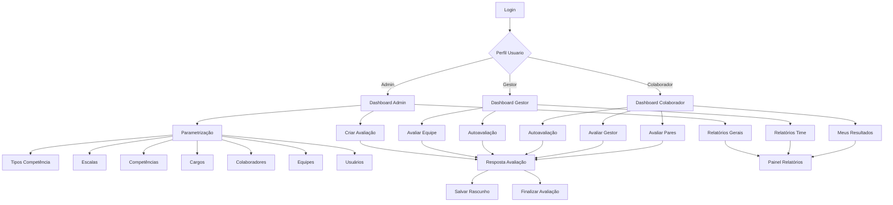

# Documento de Requisitos do Produto - Sistema de Gestão de Desempenho

## 1. Product Overview

Sistema de Gestão de Desempenho (SaaS) é uma plataforma completa de RH para criar, gerenciar, responder e analisar quatro tipos de avaliações: Desempenho, Clima Organizacional, Experiência (Onboarding) e Desligamento (Offboarding). A solução permite que organizações conduzam processos avaliativos estruturados com diferentes perfis de usuário e gerem relatórios analíticos abrangentes.

O sistema resolve a necessidade de centralizar e automatizar processos de avaliação de pessoas, oferecendo insights valiosos para tomada de decisões estratégicas em RH. Destina-se a empresas de médio e grande porte que buscam profissionalizar seus processos de gestão de pessoas.

O produto visa capturar o mercado de soluções de RH no Brasil, oferecendo uma alternativa nacional competitiva com funcionalidades específicas para o contexto empresarial brasileiro.

## 2. Core Features

### 2.1 User Roles

| Role | Registration Method | Core Permissions |
|------|---------------------|------------------|
| Admin | Cadastro direto pelo sistema | Configurar sistema, cadastrar parâmetros, criar ciclos de avaliação, visualizar todos os relatórios, gerenciar usuários |
| Gestor | Cadastro pelo Admin com vinculação a colaborador | Avaliar equipe, visualizar relatórios do time, responder avaliações como colaborador |
| Colaborador | Cadastro pelo Admin com vinculação a pessoa física | Realizar autoavaliação, avaliar gestor/pares, visualizar próprios resultados |

### 2.2 Feature Module

Nosso sistema de gestão de desempenho consiste nas seguintes páginas principais:

1. **Login**: autenticação de usuários, recuperação de senha
2. **Dashboard**: visão geral personalizada por perfil, acesso rápido às funcionalidades
3. **Cadastro de Tipos de Competência**: gerenciamento de categorias de competências
4. **Cadastro de Escalas de Competência**: definição de escalas de avaliação
5. **Cadastro de Competências**: criação de competências e perguntas avaliativas
6. **Cadastro de Cargos**: gerenciamento de cargos organizacionais
7. **Cadastro de Colaboradores**: gestão de pessoas da organização
8. **Cadastro de Equipes**: estruturação de equipes e gestores
9. **Cadastro de Usuários**: gerenciamento de acesso ao sistema
10. **Criação de Avaliação**: configuração de ciclos avaliativos
11. **Resposta de Avaliação**: interface para preenchimento de avaliações
12. **Painel de Relatórios**: visualização de análises e métricas

### 2.3 Page Details

| Page Name | Module Name | Feature description |
|-----------|-------------|---------------------|
| Login | Autenticação | Validar credenciais por email/senha, recuperar senha via email, redirecionamento baseado em perfil |
| Dashboard Admin | Visão Geral | Exibir métricas principais, botão criar avaliação, menu lateral navegação, indicadores de status |
| Dashboard Gestor | Visão Geral | Mostrar avaliações pendentes da equipe, relatórios do time, autoavaliações pendentes |
| Dashboard Colaborador | Visão Geral | Listar avaliações pendentes, histórico pessoal, resultados disponíveis |
| Cadastro Tipos Competência | Parametrização | Criar/editar/excluir tipos, validar unicidade, pesquisar registros |
| Cadastro Escalas Competência | Parametrização | Gerenciar escalas por tipo, definir pesos, validar consistência |
| Cadastro Competências | Parametrização | Vincular a tipos, criar perguntas avaliativas, categorizar por área |
| Cadastro Cargos | Parametrização | Definir hierarquia, descrições atividades, códigos únicos |
| Cadastro Colaboradores | Parametrização | Gerenciar dados pessoais, vínculos empregatícios, status situacional |
| Cadastro Equipes | Parametrização | Estruturar hierarquia, vincular gestores, definir subordinados |
| Cadastro Usuários | Parametrização | Criar acessos, definir perfis, vincular colaboradores |
| Criação Avaliação | Processo Principal | Configurar ciclo, selecionar competências, definir participantes, estabelecer prazos |
| Resposta Avaliação | Processo Principal | Avaliar competências, justificar notas, salvar rascunhos, finalizar avaliação |
| Painel Relatórios | Análises | Aplicar filtros, gerar relatórios, exportar dados, visualizar gráficos |

## 3. Core Process

### Fluxo Admin
O administrador acessa o sistema, configura parâmetros básicos (tipos de competência, escalas, competências, cargos, colaboradores, equipes), cria usuários do sistema, inicia ciclos de avaliação selecionando tipo, competências e participantes, monitora progresso através de relatórios e analisa resultados consolidados.

### Fluxo Gestor
O gestor faz login, visualiza avaliações pendentes de sua equipe no dashboard, acessa cada avaliação individual, preenche notas e justificativas por competência, salva rascunhos conforme necessário, finaliza avaliações dentro do prazo, consulta relatórios da equipe e realiza sua própria autoavaliação quando aplicável.

### Fluxo Colaborador
O colaborador acessa o sistema, verifica avaliações pendentes (autoavaliação, avaliação do gestor, avaliação de pares), preenche formulários de avaliação, justifica suas respostas, finaliza dentro dos prazos estabelecidos e consulta seus resultados históricos.

## 4. User Interface Design

### 4.1 Design Style

- **Cores Primárias**: Azul corporativo (#2563EB), Branco (#FFFFFF)
- **Cores Secundárias**: Cinza claro (#F8FAFC), Verde sucesso (#10B981), Vermelho alerta (#EF4444)
- **Estilo de Botões**: Arredondados (border-radius: 8px), com sombra sutil, efeito hover
- **Fontes**: Inter (títulos), Open Sans (corpo do texto), tamanhos 14px-24px
- **Layout**: Design limpo e minimalista, navegação lateral fixa, cards com bordas suaves
- **Ícones**: Feather Icons ou Heroicons, estilo outline, tamanho 20-24px

### 4.2 Page Design Overview

| Page Name | Module Name | UI Elements |
|-----------|-------------|-------------|
| Login | Autenticação | Layout centralizado, logo empresa topo, card branco com sombra, campos input com ícones, botão azul primário, link recuperação senha |
| Dashboard Admin | Visão Geral | Menu lateral fixo azul escuro, área principal branca, cards métricas com ícones, botão CTA destacado, breadcrumb navegação |
| Cadastro Tipos Competência | Parametrização | Formulário superior com botões ação, tabela responsiva com paginação, modal para edição, toast notifications |
| Cadastro Escalas Competência | Parametrização | Layout duas colunas, dropdown filtros, tabela ordenável, badges status, botões ação inline |
| Cadastro Competências | Parametrização | Formulário expansível, textarea pergunta, select tipo competência, preview pergunta, validação tempo real |
| Cadastro Cargos | Parametrização | Grid responsivo, search box, filtros laterais, cards cargos, modal detalhes, hierarquia visual |
| Cadastro Colaboradores | Parametrização | Formulário abas, upload foto, campos validados, status badges, histórico timeline |
| Cadastro Equipes | Parametrização | Árvore hierárquica, drag-drop membros, cards gestor/subordinados, conexões visuais |
| Cadastro Usuários | Parametrização | Tabela com avatars, badges perfil, toggle status ativo, modal senha, logs acesso |
| Criação Avaliação | Processo Principal | Layout três colunas, menu vertical tipos, formulário central dinâmico, painel pessoas lateral |
| Resposta Avaliação | Processo Principal | Header dados avaliado, abas horizontais, acordeão competências, radio buttons escala, textarea justificativa |
| Painel Relatórios | Análises | Filtros topo sticky, área gráficos responsiva, export buttons, loading states, drill-down interativo |

### 4.3 Responsiveness

O sistema é desktop-first com adaptação mobile progressiva. Breakpoints: 1200px (desktop), 768px (tablet), 480px (mobile). Menu lateral colapsa em hamburger menu em telas menores. Tabelas tornam-se cards empilhados. Formulários ajustam-se a coluna única. Touch targets mínimo 44px. Otimização para gestos touch em dispositivos móveis.

## 5. Functional Requirements

### 5.1 Authentication & Authorization
- Login via email/senha com validação
- Recuperação de senha via email
- Controle de acesso baseado em perfis
- Sessão com timeout automático
- Logs de acesso e auditoria

### 5.2 Data Management
- CRUD completo para todas entidades
- Validação de dados em tempo real
- Soft delete para preservar histórico
- Backup automático diário
- Versionamento de alterações críticas

### 5.3 Evaluation Process
- Criação de ciclos com múltiplos tipos
- Configuração flexível de participantes
- Sistema de notificações automáticas
- Controle de prazos e lembretes
- Workflow de aprovação quando necessário

### 5.4 Reporting & Analytics
- 30 relatórios pré-configurados
- Filtros dinâmicos e drill-down
- Exportação em PDF/Excel
- Dashboards interativos
- Alertas automáticos por métricas

### 5.5 System Administration
- Configuração de parâmetros globais
- Gestão de usuários e permissões
- Monitoramento de performance
- Logs de sistema e auditoria
- Backup e restore de dados

## 6. Non-Functional Requirements

### 6.1 Performance
- Tempo de resposta < 2 segundos
- Suporte a 1000 usuários simultâneos
- Disponibilidade 99.5%
- Backup diário automatizado

### 6.2 Security
- Criptografia de dados sensíveis
- Autenticação segura
- Controle de acesso granular
- Logs de auditoria completos

### 6.3 Usability
- Interface intuitiva e responsiva
- Suporte a múltiplos navegadores
- Acessibilidade WCAG 2.1 AA
- Documentação e help online

### 6.4 Scalability
- Arquitetura modular
- Database otimizada
- Cache inteligente
- CDN para assets estáticos